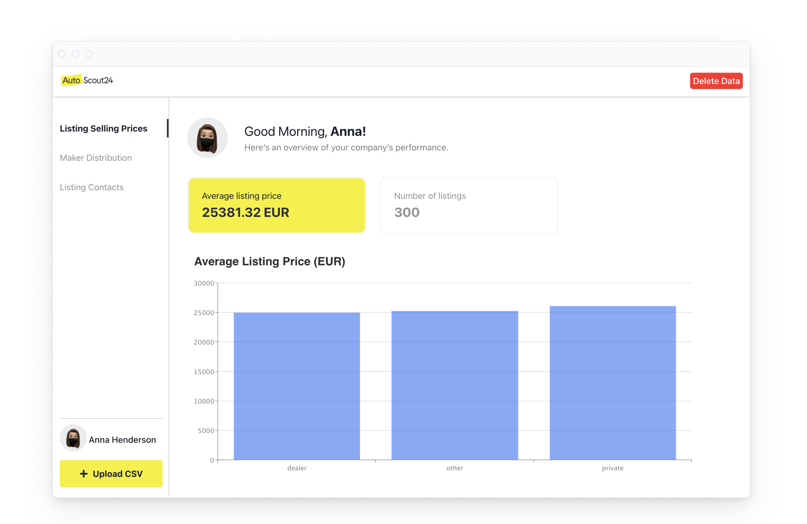
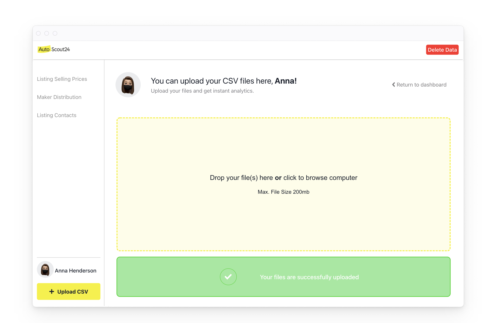

# Company Dashboard – CSV uploader
This is a simple dashboard to illustrate data for a cars marketplace.
Users can upload CSV files in a specified format and are displayed simple metrics.
Sample CSV files can be found in the **test-files** directory.

## Setup
This setup assumes that you have installed Node.js and React.js on your machine.

Clone the repository and navigate into the company-dashboard folder. 
The instructions assume that you are starting in the main directory company-dashboard.
```
git clone https://github.com/mitrotasios/company-dashboard.git
```

Install the dependencies for the client and the server
```
cd dashboard-server
npm install
cd ..
cd dashboard-client
npm install
```

Run the server and client concurrently
```
cd dashboard-server
npm run dev
```

Run the server only
```
cd dashboard-server
npm run server
```

Run the client only
```
cd dashboard-server
npm run client
```

## Using the web-app
The server should be served on port ```3000```. You can then open the web app through ```[your ip address]:3000``` (http://localhost:3000/) and you should be directed to the front-page:



In order to upload files, click the **"Upload CSV"** button, which navigates to the upload page.
Drag & drop the CSV files into the yellow box or click the box and browse your computer.\
*NOTE*: duplicate data is not permitted and an an error message will be displayed. Please click on the **"Delete Data"** button on the top-right in order to clear the database and re-upload the same files again.



